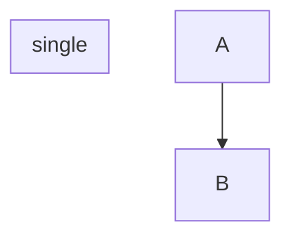
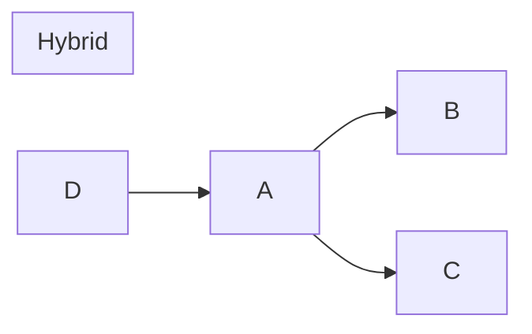
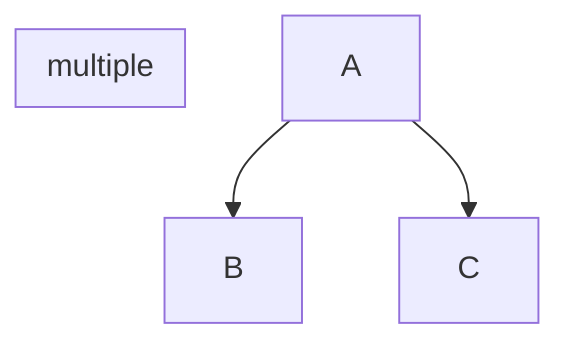
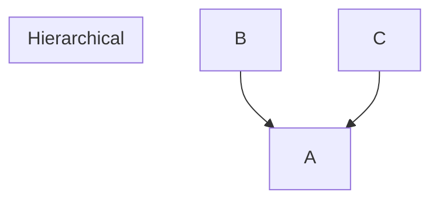
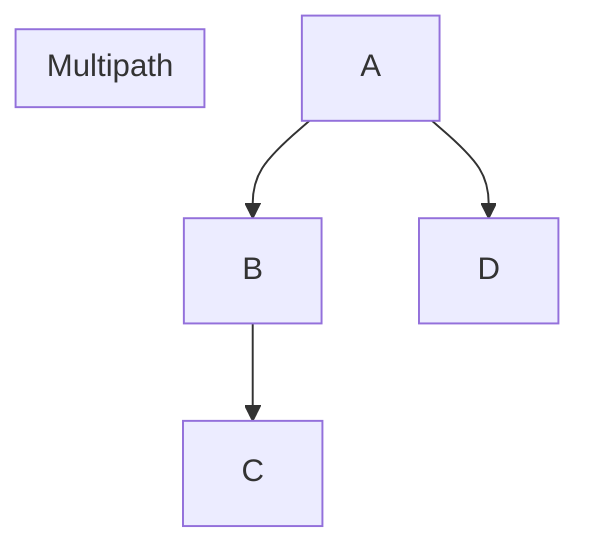
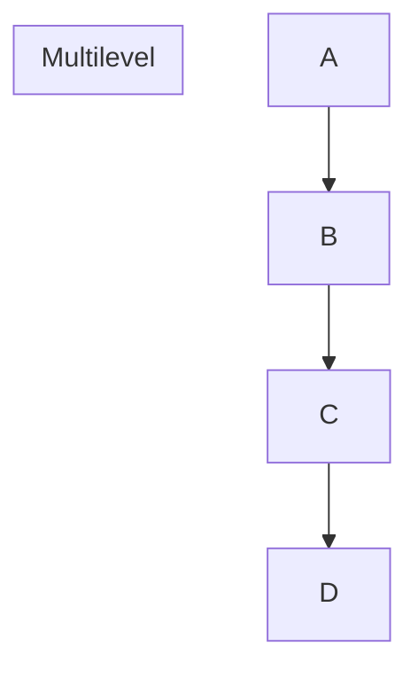

# Inheritance:
- With inheritance, a derived class inherits the already existing class's features (base class)
- Inheritance refers to using the structure and behavior of a parent class in a subclass
- Inheritance is applied to classes
- Inheritance can be of single, hybrid,multiple, hierarchical, multipath, and multilevel types.

- Inheritance supports code reusability and reduces lines of code

# Polymorphism:
- Polymorphism allows class methods to exist in multiple forms
- Polymorphism intends on changing the behavior of parent class’s method
- Polymorphism is applied to methods 
- Polymorphism has two types: [[compile time]] and [[run time]] polymorphism decides which form of the function to be invoked.



