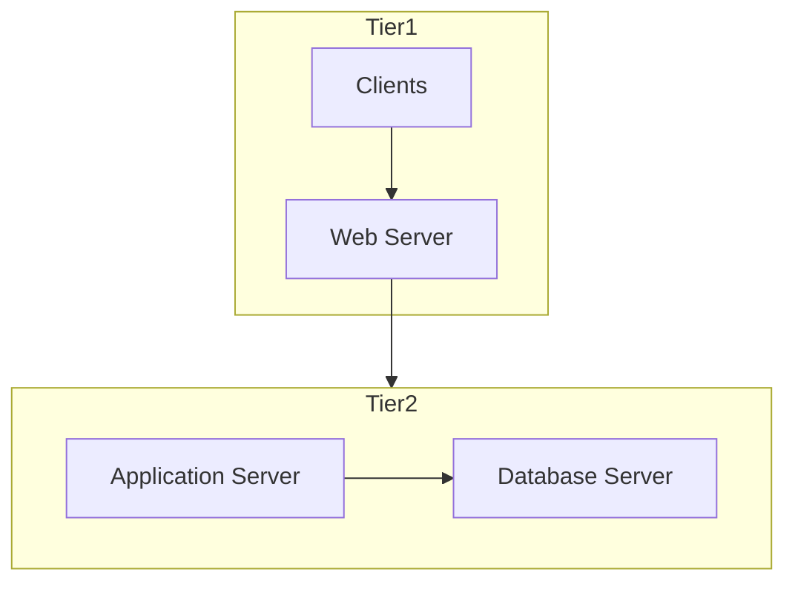

## *2-Tier Architecture:*
---
- There are two things in it:
	1. Client Layer
	2. Database Layer
- client directly interact with database, which cause two issue of security.
- on other hand if the system increase its customer, access data time , data storage etc will increase which will be hard for scalability it.
- There will be bottleneck in it.
- The best thing in this is maintenance.



## *3-Tier Architecture : *
---
- There are three Layers:
	1. Client layer
	2. Application layer
	3. Server layer
- No directly relation between client and server
- client dont have any information of storage place.
- Application layer manipulating the query to only fetch the required data.
- Here will be no bottleneck.
- here maintenance will be expensive.

 
 ```mermaid
 graph TD
  subgraph Tier1
    A[Client]
    B[Web Server]
  end
  subgraph Tier2
    C[Application Server]
    D[Application Server]
  end
  subgraph Tier3
    E[Database Server]
    F[Database Server]
  end
  A --> B
  B --> C
  B --> D
  C --> E
  D --> F

```